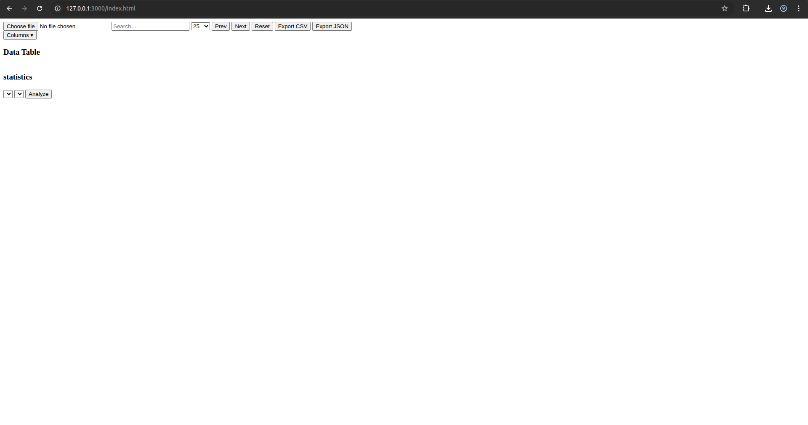
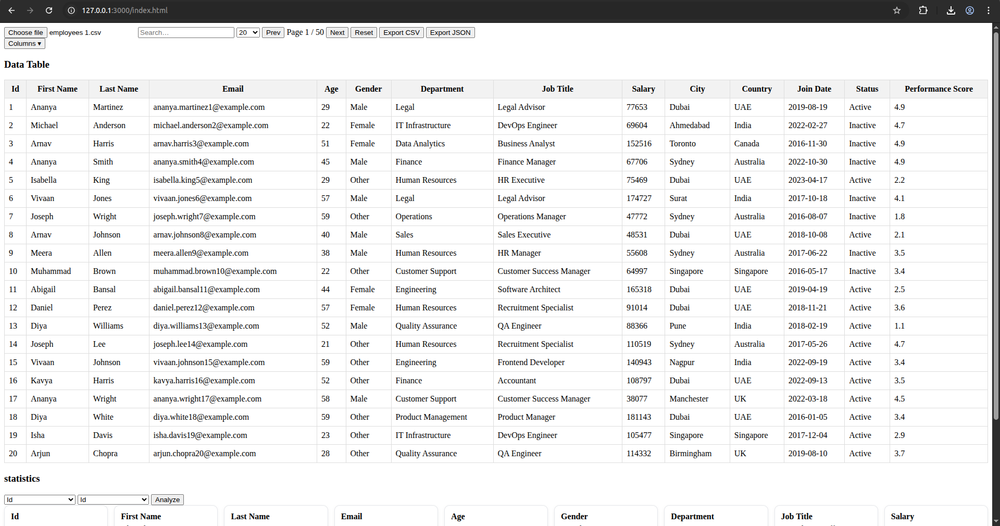
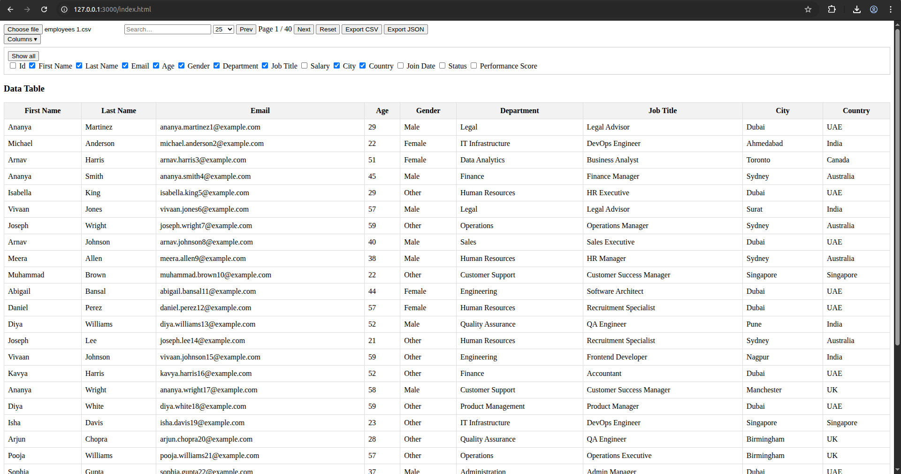
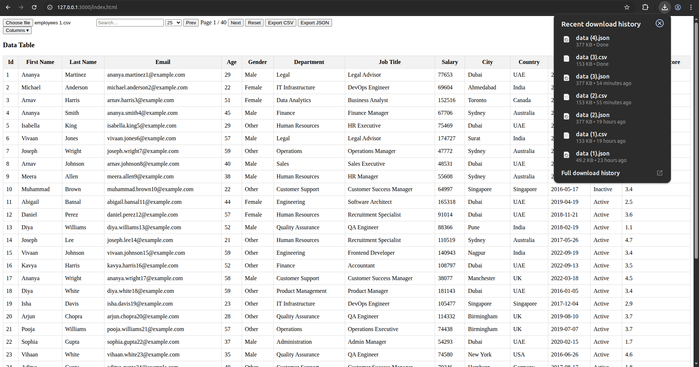
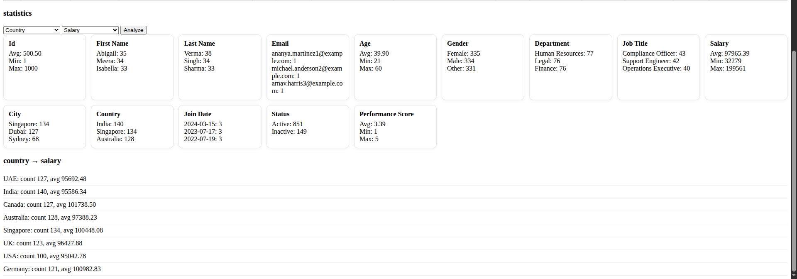
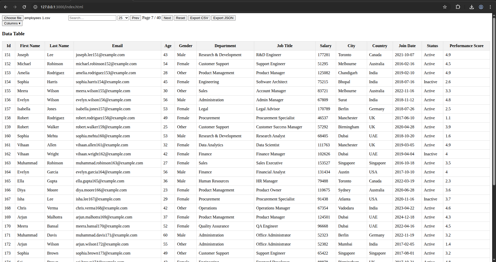

# JS Practical - CSV Data Explorer 
An interactive data exploration web application built with pure JavaScript that loads CSV datasets and provides powerful data operations such as filtering, sorting, column visibility, exporting, and analytics.




## Run This Project Locally

You can replicate and run this project on your local machine in just a few simple steps.  
Assuming you have git/github and a browser.

### Option 1: Clone the Repository (Recommended)

Open your terminal and run:

```bash
git clone https://github.com/Aryan-simform/CSV-data-Viewer-JS2

cd html-practical
```
---

### Option 2: Download ZIP (Simple)

1.  Go to the repository: [Aryan-simform/html-practical](https://github.com/Aryan-simform/CSV-data-Viewer-JS2)
2.  Click the green **Code** button.
3.  Select **Download ZIP**.
4.  Extract the ZIP file.

Now open the project:

Double-click index.html  
OR  
Right-click → Open with browser

---
### Optional: Run Using Live Server 

If you are using VS Code:

Install the Live Server extension

Open the project folder in VS Code

Right-click on index.html

Select Open with Live Server

## Features Implemented

### Column Visibility Toggle

Users can dynamically show or hide columns without mutating the dataset.
The table, statistics, and export adapt automatically.

Screenshot:


### Export Filtered / Selected Data (CSV & JSON)
The export system respects:

active filters

column visibility

Screenshot:
Add image here

### Summary Statistics (Counts & Averages)

Automatic statistics generated per column:

numeric → avg / min / max

categorical → counts 
updates with filters

Also supports grouped analysis (pivot-like).

Screenshot:

### Reset Filters & Sorting

One-click reset restores:

filters

sorting

pagination

stats context


## Folder Structure
<pre>
JS_CSV_Data_explorer/
├── docs/
│   ├── assignment.md
│   └── sample.csv
├── src/
│   ├── columns.js      # Column visibility logic
│   ├── export.js       # CSV/JSON export
│   ├── selectors.js    # Filtering, sorting, pagination
│   ├── state.js        # Global state + state updates
│   ├── statistics.js   # Column & grouped stats
│   └── utils.js        # Parsing & helpers
├── index.html          # UI
├── script.js           # App orchestration
├── style.css           # Styling
└── README.md
</pre>


### Pagination 
